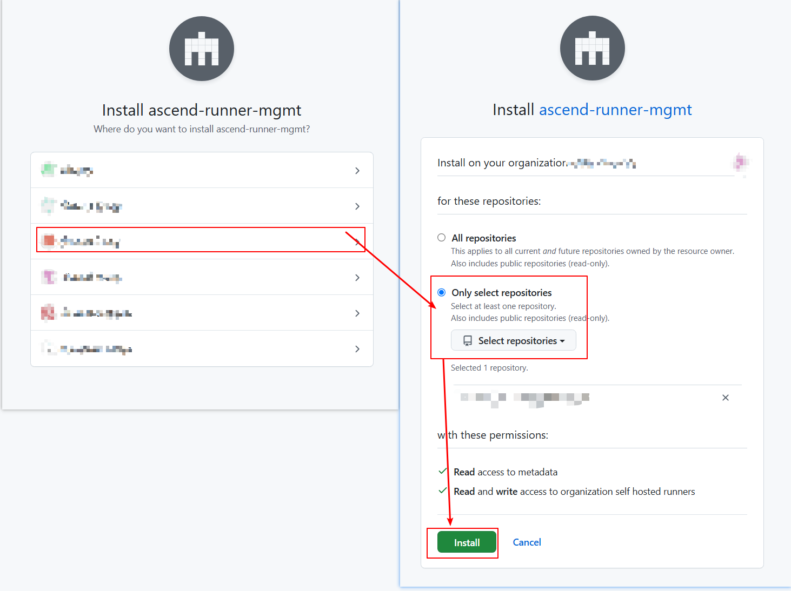
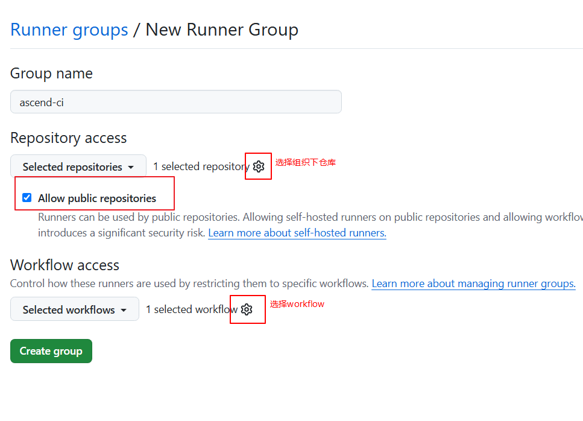

# 组织管理员

## 1 安装 github app
在浏览器输入`https://github.com/apps/ascend-runner-mgmt`并且点击`Install`或者`Configure`


选择组织，选择仓库，点击`Install`


## 2 获取 github app 的 installation-id
依次点击组织的`Settings`, `GitHub Apps`, `ascend-runner-mgmt`的`Configure`，进入install页面。

`installation url`形如`https://github.com/organizations/<your-organization>/settings/installations/<installation-id>`，将`installation-id`提交给后端配置。

## 3 配置 runner group
依次点击组织的`Settings`, `Actions`, `Runner groups`, `New runner group`，进入创建页面。


配置好`group name, repository access, workflow access`即可创建`runner group`。`group name`需要提交给后端配置。

注意：如果未打钩`Allow public repositories`，则无法让`public`仓库执行`github action`。

如果要限定`workflow`范围，`Workflow access`写法如下，多个分支以逗号分隔。
```text
<organization>/<repo>/.github/workflows/<workflow.yaml>@<branch>
例子：
my-org/my-repo/.github/workflows/my.yaml@main
```


配置好后，runners为0


## 4 等待后端配置
提交给后端的字段有
```yaml
installation-id: 61307243
group-name: ascend-ci
npu-counts: 1, 2
```
后端配置好后，可以在runners查看。`Status`为`Online`表示可以运行。为`Offline`表示无法运行。


## 5 测试使用
测试workflow：
```yaml
name: Test NPU
on:
  workflow_dispatch:

jobs:
  Job-npu-1:
    runs-on: linux-arm64-npu-1
    steps:
    - name: Show NPU info
      run: |
        npu-smi info
  Job-npu-2:
    runs-on: linux-arm64-npu-2
    steps:
    - name: Show NPU info
      run: |
        npu-smi info
```
依次点击`Actions`, `Test NPU`, `Run workflow`, `Run workflow`即可实现测试。


# workflow使用者
使用者只需将`runs-on`字段填写为`runners group`中的`runners`字段即可使用。

无需挂载硬件，无需指定容器。
