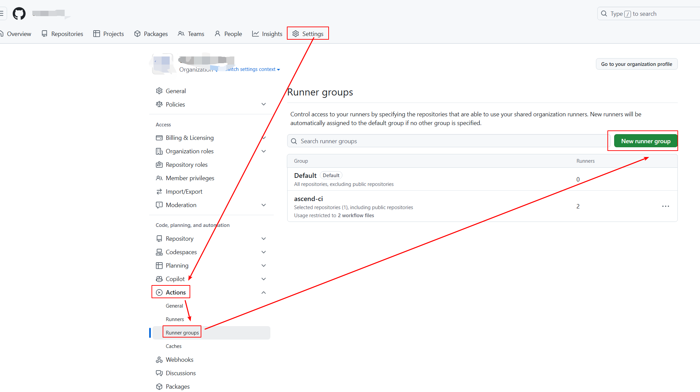

# 1 组织安装github app
## 1 github app
参考[nvidia github app](https://github.com/apps/nvidia-runner-mgmt/)生成[ascend github app](https://github.com/apps/ascend-runner-mgmt)。权限为
```
Repository Permissions
    Metadata (read)
Organization Permissions
    Self-hosted runners (read / write)
```
每个组织只需要安装1次`ascend github app`，安装好后可以在`github app`配置页面动态选择仓库。
## 2 安装指南
在浏览器输入`https://github.com/apps/ascend-runner-mgmt`并且点击`Install`

选择组织，选择仓库，点击安装，


## 3 获取installation-id
依次点击组织的`Settings`, `GitHub Apps`, `ascend-runner-mgmt`的`Configure`，进入install页面。

`installation url`形如`https://github.com/organizations/<your-organization>/settings/installations/<installation-id>`，将`installation-id`提交给后端配置。

# 2 组织配置runner group
## 1 为什么要配置runner group
1. 如果`RunnserSet`配置在仓库层面，权限要求过高(admin:read/write)。如果配置在组织层面，在默认的`runner group`下，[`public`仓库无法访问`RunnserSet`](https://docs.github.com/en/actions/hosting-your-own-runners/managing-self-hosted-runners/adding-self-hosted-runners
)。自定义`runner group`可以解决这个问题。
```
For security reasons, public repositories can't use runners in a runner group by default, but you can override this in the runner group's settings. For more information, see Managing access to self-hosted runners using groups.
```
2. `runner group`可以指定仓库与`workflow`，限定执行`RunnserSet`的范围。
## 2 如何配置
依次点击组织的`Settings`, `Actions`, `Runner groups`, `New runner group`，进入创建页面。


配置好`group name, repository access, workflow access`即可创建`runner group`。`group name`需要提交给后端配置。

注意：如果未打钩`Allow public repositories`，则无法让`public`仓库执行`github action`。

如果要限定`workflow`范围，`Workflow access`写法如下，多个分支以逗号分隔。
```text
<organization>/<repo>/.github/workflows/<workflow.yaml>@<branch>
例子：
my-org/my-repo/.github/workflows/my.yaml@main
```


# 3 配置Workflow
示例如下
```yaml
name: Test Self Hosted Runners
on:
  workflow_dispatch:

jobs:
  npu-job:
    runs-on: linux-arm64-npu-1
    steps:
    - name: Show NPU info
      run: |
        npu-smi info
```
其中runs-on字段填写枚举量
|runs-on|含义|
|--|--|
|linux-arm64-npu-1|1张NPU卡|
|linux-arm64-npu-2|2张NPU卡|

# 4 后端流程
每个组织单独配置一个namespace。每个namespace下有n个`RunnerSet`，分别挂载1-n张NPU卡。根据workflow的`runs-on`字段匹配`RunnerSet`。

目前`RunnerSet`是手动配置的，需要三个参数。1. 组织名称。2. github app的installation-id。3. runner group的group name。

当用户执行`workflow`，`RunnerSet`启动一个pod执行job，执行完成自动销毁。


# 5 参考
1. [NVIDIA GitHub Action Runners](https://docs.gha-runners.nvidia.com/)
